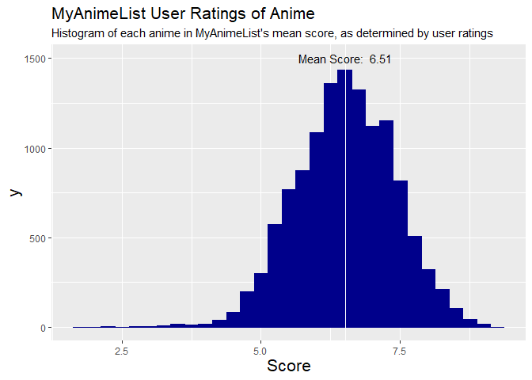
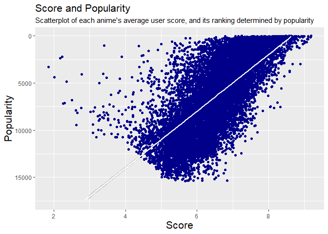
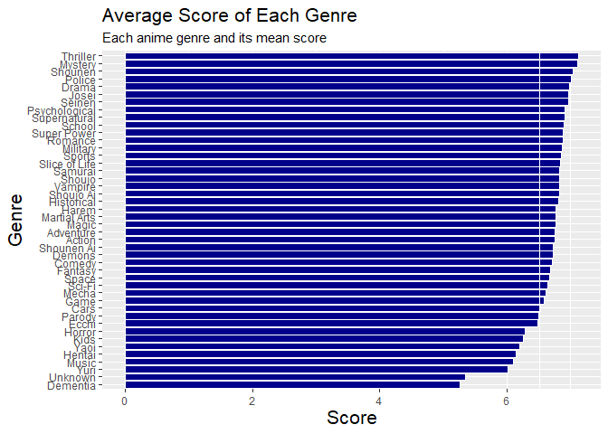
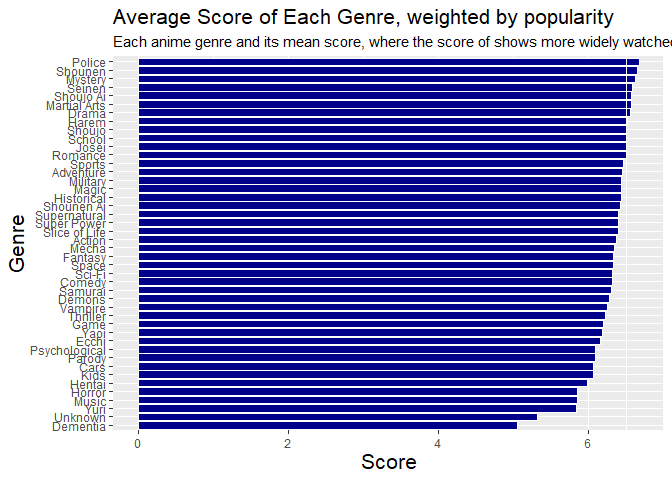
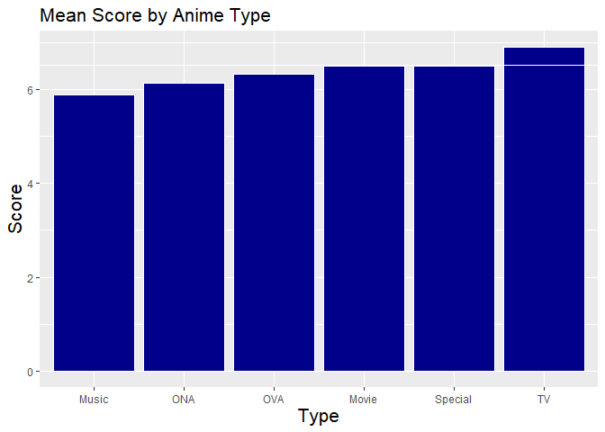
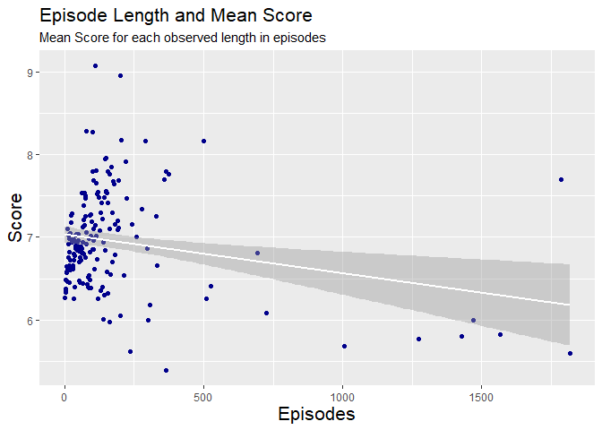
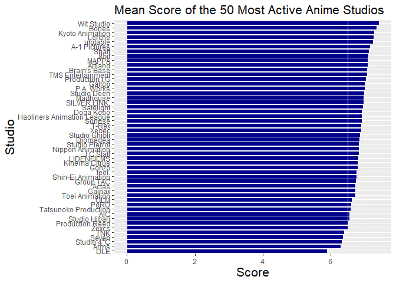
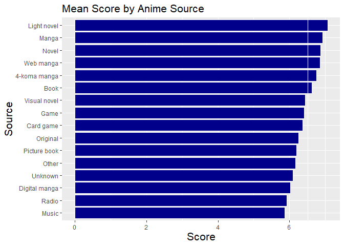
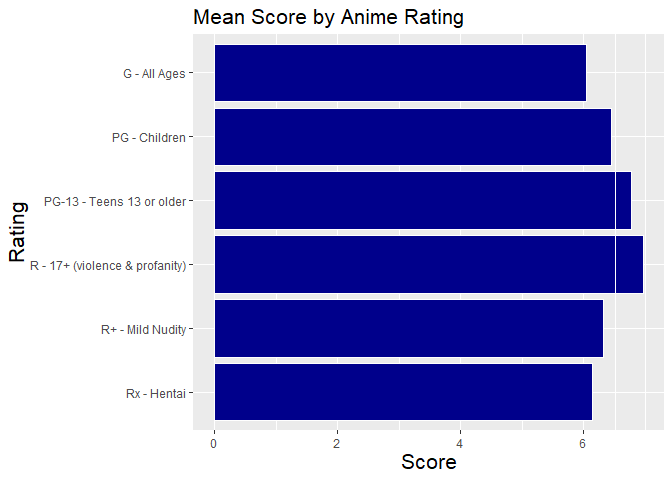

Here I attempted to find which qualities are associated with "good" anime, defined by getting higher user scores on the website MyAnimeList, where users may add to their list any anime they've watched, and give it a score 1-10. The website then keeps track of the mean rating of all user scores To answer this, I found some [publicly available data](https://www.kaggle.com/datasets/azathoth42/myanimelist) on Kaggle.

## The Data

Loading relevant libraries and the dataset: 

```r
library(tidyverse)
df <- read_csv("../data/myanimelist/anime.csv")
```

Here we can take a look at our dataset. It includes information ranging from genre and source material, popularity ranking, number of episodes, to various data about the way it's added to users' lists.

```r
head(df)
```

<div data-pagedtable="false">
  <script data-pagedtable-source type="application/json">
{"columns":[{"label":["MAL_ID"],"name":[1],"type":["dbl"],"align":["right"]},{"label":["Name"],"name":[2],"type":["chr"],"align":["left"]},{"label":["Score"],"name":[3],"type":["chr"],"align":["left"]},{"label":["Genres"],"name":[4],"type":["chr"],"align":["left"]},{"label":["English name"],"name":[5],"type":["chr"],"align":["left"]},{"label":["Japanese name"],"name":[6],"type":["chr"],"align":["left"]},{"label":["Type"],"name":[7],"type":["chr"],"align":["left"]},{"label":["Episodes"],"name":[8],"type":["chr"],"align":["left"]},{"label":["Aired"],"name":[9],"type":["chr"],"align":["left"]},{"label":["Premiered"],"name":[10],"type":["chr"],"align":["left"]},{"label":["Producers"],"name":[11],"type":["chr"],"align":["left"]},{"label":["Licensors"],"name":[12],"type":["chr"],"align":["left"]},{"label":["Studios"],"name":[13],"type":["chr"],"align":["left"]},{"label":["Source"],"name":[14],"type":["chr"],"align":["left"]},{"label":["Duration"],"name":[15],"type":["chr"],"align":["left"]},{"label":["Rating"],"name":[16],"type":["chr"],"align":["left"]},{"label":["Ranked"],"name":[17],"type":["chr"],"align":["left"]},{"label":["Popularity"],"name":[18],"type":["dbl"],"align":["right"]},{"label":["Members"],"name":[19],"type":["dbl"],"align":["right"]},{"label":["Favorites"],"name":[20],"type":["dbl"],"align":["right"]},{"label":["Watching"],"name":[21],"type":["dbl"],"align":["right"]},{"label":["Completed"],"name":[22],"type":["dbl"],"align":["right"]},{"label":["On-Hold"],"name":[23],"type":["dbl"],"align":["right"]},{"label":["Dropped"],"name":[24],"type":["dbl"],"align":["right"]},{"label":["Plan to Watch"],"name":[25],"type":["dbl"],"align":["right"]},{"label":["Score-10"],"name":[26],"type":["chr"],"align":["left"]},{"label":["Score-9"],"name":[27],"type":["chr"],"align":["left"]},{"label":["Score-8"],"name":[28],"type":["chr"],"align":["left"]},{"label":["Score-7"],"name":[29],"type":["chr"],"align":["left"]},{"label":["Score-6"],"name":[30],"type":["chr"],"align":["left"]},{"label":["Score-5"],"name":[31],"type":["chr"],"align":["left"]},{"label":["Score-4"],"name":[32],"type":["chr"],"align":["left"]},{"label":["Score-3"],"name":[33],"type":["chr"],"align":["left"]},{"label":["Score-2"],"name":[34],"type":["chr"],"align":["left"]},{"label":["Score-1"],"name":[35],"type":["chr"],"align":["left"]}],"data":[{"1":"1","2":"Cowboy Bebop","3":"8.78","4":"Action, Adventure, Comedy, Drama, Sci-Fi, Space","5":"Cowboy Bebop","6":"カウボーイビバップ","7":"TV","8":"26","9":"Apr 3, 1998 to Apr 24, 1999","10":"Spring 1998","11":"Bandai Visual","12":"Funimation, Bandai Entertainment","13":"Sunrise","14":"Original","15":"24 min. per ep.","16":"R - 17+ (violence & profanity)","17":"28.0","18":"39","19":"1251960","20":"61971","21":"105808","22":"718161","23":"71513","24":"26678","25":"329800","26":"229170.0","27":"182126.0","28":"131625.0","29":"62330.0","30":"20688.0","31":"8904.0","32":"3184.0","33":"1357.0","34":"741.0","35":"1580.0"},{"1":"5","2":"Cowboy Bebop: Tengoku no Tobira","3":"8.39","4":"Action, Drama, Mystery, Sci-Fi, Space","5":"Cowboy Bebop:The Movie","6":"カウボーイビバップ 天国の扉","7":"Movie","8":"1","9":"Sep 1, 2001","10":"Unknown","11":"Sunrise, Bandai Visual","12":"Sony Pictures Entertainment","13":"Bones","14":"Original","15":"1 hr. 55 min.","16":"R - 17+ (violence & profanity)","17":"159.0","18":"518","19":"273145","20":"1174","21":"4143","22":"208333","23":"1935","24":"770","25":"57964","26":"30043.0","27":"49201.0","28":"49505.0","29":"22632.0","30":"5805.0","31":"1877.0","32":"577.0","33":"221.0","34":"109.0","35":"379.0"},{"1":"6","2":"Trigun","3":"8.24","4":"Action, Sci-Fi, Adventure, Comedy, Drama, Shounen","5":"Trigun","6":"トライガン","7":"TV","8":"26","9":"Apr 1, 1998 to Sep 30, 1998","10":"Spring 1998","11":"Victor Entertainment","12":"Funimation, Geneon Entertainment USA","13":"Madhouse","14":"Manga","15":"24 min. per ep.","16":"PG-13 - Teens 13 or older","17":"266.0","18":"201","19":"558913","20":"12944","21":"29113","22":"343492","23":"25465","24":"13925","25":"146918","26":"50229.0","27":"75651.0","28":"86142.0","29":"49432.0","30":"15376.0","31":"5838.0","32":"1965.0","33":"664.0","34":"316.0","35":"533.0"},{"1":"7","2":"Witch Hunter Robin","3":"7.27","4":"Action, Mystery, Police, Supernatural, Drama, Magic","5":"Witch Hunter Robin","6":"Witch Hunter ROBIN (ウイッチハンターロビン)","7":"TV","8":"26","9":"Jul 2, 2002 to Dec 24, 2002","10":"Summer 2002","11":"TV Tokyo, Bandai Visual, Dentsu, Victor Entertainment","12":"Funimation, Bandai Entertainment","13":"Sunrise","14":"Original","15":"25 min. per ep.","16":"PG-13 - Teens 13 or older","17":"2481.0","18":"1467","19":"94683","20":"587","21":"4300","22":"46165","23":"5121","24":"5378","25":"33719","26":"2182.0","27":"4806.0","28":"10128.0","29":"11618.0","30":"5709.0","31":"2920.0","32":"1083.0","33":"353.0","34":"164.0","35":"131.0"},{"1":"8","2":"Bouken Ou Beet","3":"6.98","4":"Adventure, Fantasy, Shounen, Supernatural","5":"Beet the Vandel Buster","6":"冒険王ビィト","7":"TV","8":"52","9":"Sep 30, 2004 to Sep 29, 2005","10":"Fall 2004","11":"TV Tokyo, Dentsu","12":"Unknown","13":"Toei Animation","14":"Manga","15":"23 min. per ep.","16":"PG - Children","17":"3710.0","18":"4369","19":"13224","20":"18","21":"642","22":"7314","23":"766","24":"1108","25":"3394","26":"312.0","27":"529.0","28":"1242.0","29":"1713.0","30":"1068.0","31":"634.0","32":"265.0","33":"83.0","34":"50.0","35":"27.0"},{"1":"15","2":"Eyeshield 21","3":"7.95","4":"Action, Sports, Comedy, Shounen","5":"Unknown","6":"アイシールド21","7":"TV","8":"145","9":"Apr 6, 2005 to Mar 19, 2008","10":"Spring 2005","11":"TV Tokyo, Nihon Ad Systems, TV Tokyo Music, Shueisha","12":"VIZ Media, Sentai Filmworks","13":"Gallop","14":"Manga","15":"23 min. per ep.","16":"PG-13 - Teens 13 or older","17":"604.0","18":"1003","19":"148259","20":"2066","21":"13907","22":"78349","23":"14228","24":"11573","25":"30202","26":"9226.0","27":"14904.0","28":"22811.0","29":"16734.0","30":"6206.0","31":"2621.0","32":"795.0","33":"336.0","34":"140.0","35":"151.0"}],"options":{"columns":{"min":{},"max":[10]},"rows":{"min":[10],"max":[10]},"pages":{}}}
  </script>
</div>

There are various ways these anime could be measured as good-- for example, the number of "10" scores it has been given, or the inverse proportion of people who've "dropped" the show (that is, adding it to your list incomplete, with no intention of finishing it).

For this analysis, the quality of an anime will be judged by its mean user score, determined by the Score column. Because this and the episode column are both Characters and not Numerics, we'll convert them here as well. Additionally, some anime do not have scores, oftentimes because too few members have added it to their list. As the quality of these is completely unknown and cannot be reliably guessed. These rows will be removed.


# User Scores

MyAnimeList scores are not centered at 5/10, but instead around 6.51/10. While it is often joked that the lower half of the rating scale goes completely unused, others posit that it's because people seek out anime that they believe they would enjoy-- that if they randomly sampled the anime they watch instead, the mean score would drop considerably.


```r
ggplot(data = df) + 
  geom_histogram(mapping = aes(x=Score), color="darkblue", fill="darkblue", binwidth=0.25) + 
  labs(title= "MyAnimeList User Ratings of Anime", subtitle="Histogram of each anime in MyAnimeList's mean score, as determined by user ratings") + 
  theme(axis.title = element_text(size=16), plot.title = element_text(size=16)) +  
  geom_vline(xintercept=mean(df$Score),color="white") + 
  annotate("text",x=mean(df$Score),y=1500,label = paste("Mean Score: ", toString(round(mean(df$Score),2))))
```

<!-- -->

# Scores and Popularity

Unsurprisingly, one of metrics most associated with higher anime scores is its popularity rating. However, popularity is not something one may typically know in advance. So while it may be a good way to find quality anime that has already aired, it says little about the quality of unknown, upcoming anime.


```r
ggplot(data = df, mapping = aes(x=Score, y=Popularity)) + 
  geom_point(color="darkblue") + scale_y_reverse(lim = c(17565,0)) + 
  geom_smooth(method="lm", color="white") + 
  labs(title="Score and Popularity", subtitle="Scatterplot of each anime's average user score, and its ranking determined by popularity") + 
  theme(axis.title = element_text(size=16), plot.title = element_text(size=16))
```

<!-- -->

# Scores and Genre

The next variable investigated was Genre. Because multiple genres were contained in each cell, I split the strings by their delimiter ", ".


```r
genre_extractor <- function(x) {str_split(x,", ")[[1]]}
genre_lists <- apply(select(df,Genres), 1, genre_extractor)
```

Following this, I created columns for a new dataframe. If some anime in the original dataframe had three listed genres, then the new dataframe would split this into three different rows. Other columns I've kept for this new dataframe were score and popularity.


```r
genre <- c()
score <- c()
popularity <- c()
for (i in seq_along(genre_lists)) {
  for (g in genre_lists[[i]]){
    genre <- append(genre, g)
    score <- append(score, df$Score[i])
    popularity <- append(popularity, df$Popularity[i])
  }
}
```

Finally, I grouped by each genre, aggregating with the mean of each score.


```r
genre_df <- data.frame(genre, score, popularity)
genre_scores_unweighted <- genre_df %>%
  group_by(genre) %>%
  summarize(mean(score))
genre_scores_unweighted <- rename(genre_scores_unweighted, score = "mean(score)")
genre_scores_unweighted <- arrange(genre_scores_unweighted, score)
```

Once we have this we can plot the results, with the mean score shown as a white line once again.


```r
ggplot(genre_scores_unweighted, aes(x=reorder(genre,score), y=score)) + 
  geom_bar(stat='identity', color="white", fill="darkblue") + 
  theme(plot.title=element_text(size=16), axis.title = element_text(size=16)) + 
  labs(title="Average Score of Each Genre", subtitle = "Each anime genre and its mean score", x="Genre", y="Score") + 
  coord_flip() + 
  geom_hline(yintercept=mean(df$Score),color="white")
```

<!-- -->

It appears that the "Thriller" and "Mystery" genres tend to score the highest, though only slightly higher than those below it. Overall, it appears that most of the genres score similarly to each other, but that these two genres tend to have the biggest edge over the others.

As for genres to avoid in search of highly-scoring anime, there appears to be a noticeable drop in score when it comes to Horror and Kids anime, music videos, and the often pornographic genres Yaoi, Yuri, and Hentai. The experimental "Dementia" tag, as well as anime with unknown genres, are by far the lowest scoring.

# Adjusting genre scores by popularity

As a result of some domain knowledge, I knew that there are infrequently-viewed, infamously *bad* experimental works known for their hilariously bad quality, and I wanted to see if adjusting for what people are actually watching might change the order of the genres.

I created a new weighted score which takes into account the popularity of each anime when determining the score for each genre. For example, if one anime is watched ten times as much as another in its genre, its score will be ten times as weighted.


```r
genre_df$weighted_scores <- genre_df$score * genre_df$popularity
genre_popularity <- genre_df %>% 
  group_by(genre) %>% 
  summarize(sum(popularity)) %>% 
  rename(cumulative_popularity = "sum(popularity)")
genre_scores_weighted <- genre_df %>% 
  group_by(genre) %>% 
  summarize(sum(weighted_scores)) %>% 
  rename(weighted_score = 'sum(weighted_scores)')
genre_scores_weighted <- merge(genre_scores_weighted, genre_popularity)
genre_scores_weighted$score <- genre_scores_weighted$weighted_score / genre_scores_weighted$cumulative_popularity
```

With the weighted scores created, we can plot again.


```r
ggplot(genre_scores_weighted, aes(x=reorder(genre,score), y=score)) + 
  geom_bar(stat='identity', color="white", fill="darkblue") + 
  theme(plot.title=element_text(size=16), axis.title = element_text(size=16)) + 
  labs(title="Average Score of Each Genre, weighted by popularity", subtitle = "Each anime genre and its mean score, where the score of shows more widely watched hold more weight", x="Genre", y="Score") + 
  coord_flip() + 
  geom_hline(yintercept=mean(df$Score),color="white")
```

<!-- -->

Overall, the order did not change as much, meaning it may be qualities of the genres instead. However, Thriller seemed to have dropped substantially, suggesting potentially that little-known thrillers may have higher scores than popular thrillers.

# Influence of Anime Format

One of the other factors which may be relevant is the format of the anime itself-- as they can range from TV series, to movies, music videos, OVA (Original Video Animation, not televised but released separately such as on DVD/BluRay), or ONA (Original Net Animation, like the former except distributed digitally).


```r
type_df <- df %>% 
  group_by(Type) %>% 
  summarize(mean(Score)) %>% 
  rename(Score = 'mean(Score)')
ggplot(type_df) + 
  geom_bar(mapping = aes(x=reorder(Type,Score),y=Score), stat="identity", color="white", fill="darkblue") + 
  labs(title="Mean Score by Anime Type", x="Type") + 
  theme(plot.title=element_text(size=16), axis.title=element_text(size=16)) + 
  geom_hline(yintercept=mean(df$Score),color="white")
```

<!-- -->

It appears that TV Series make up the bulk of scored anime, being the sole format above the mean, and therefore responsible for dragging it upwards considerably. Ultimately, it's the only format which has an above-average mean score.

# Release Timing

While unlikely, I thought it was nonetheless worth investigating whether shows released during a particular time with get higher scores. For example, perhaps anime studios are aware that there is more frequent television-viewing during a particular time, and therefore opt to release their more highly-invested works during this time period.


```r
season_getter <- function(x) {str_split(x, " ")[[1]][1]}
seasons <- apply(select(df,Premiered), 1,season_getter)
season <- c()
score <- c()
for (i in seq_along(seasons)) {
  season <- append(season, seasons[i])
  score <- append(score, df$Score[i])
}
season_df <- data.frame(season, score)
season_df <- season_df %>% 
  group_by(season) %>% 
  summarize(mean(score)) %>% 
  rename(score = "mean(score)")
ordering <- c("Unknown","Winter","Spring","Summer","Fall")
season_df <- season_df[match(ordering,season_df$season),]
head(season_df)
```

<div data-pagedtable="false">
  <script data-pagedtable-source type="application/json">
{"columns":[{"label":["season"],"name":[1],"type":["chr"],"align":["left"]},{"label":["score"],"name":[2],"type":["dbl"],"align":["right"]}],"data":[{"1":"Unknown","2":"6.337923"},{"1":"Winter","2":"6.849937"},{"1":"Spring","2":"6.904003"},{"1":"Summer","2":"6.860904"},{"1":"Fall","2":"6.948232"}],"options":{"columns":{"min":{},"max":[10]},"rows":{"min":[10],"max":[10]},"pages":{}}}
  </script>
</div>

However, this seems not to be the case. The mean scores of each of the four seasons vary only by 0.1. Seasons with an unknown premier date have a much smaller mean score, but this could be the result of the Score-Popularity relationship already established-- obscure and unpopular shows may not have a known premier date, and due to score and popularity being associated, they have a lower score as well.

# The Influence of Episode Length

Another element I felt worth investigating was the effect of episode length and mean score.


```r
episode_df <- df %>% 
  group_by(Episodes) %>% 
  summarize(mean(Score)) %>% 
  rename(Score = "mean(Score)")
ggplot(episode_df, aes(x=Episodes,y=Score)) + 
  geom_point(color="darkblue") + 
  geom_smooth(method="lm",color="white") + 
  labs(title="Episode Length and Mean Score", subtitle="Mean Score for each observed length in episodes") + 
  theme(axis.title=element_text(size=16), plot.title = element_text(size=16))
```

```
## `geom_smooth()` using formula 'y ~ x'
```

<!-- -->

It appears that episode length and score are very weakly associated. Extremely long-running anime seem to have much lower scores, though this may also be due to the confounding factor that long-running anime are overwhelmingly kid's anime, which have been established to be a very low-scoring genre. Outside of this, there is not a clear association.

# Major Studios and Anime Quality

Another element worth analyzing is the studio that created the anime, as many tend to be excited when particular studios work on a new project. Because they were arranged similarly to genre (multiple in one cell, using ", " as a delimiter; oftentimes multiple studios will work on a single project), I used the function previously used for genre in order to split the studios out.

Additionally, there are hundreds of studios in existence, many of which no longer being active, and many being made solely for one or two projects before disbanding. As the goal is to predict which anime would be considered high-quality, I decided to use the studios which would be most likely present for prediction-- that is, highly active anime studios.

In order to do this, I first took into account the occurrences of each studio when collapsing them from their delimitted form.


```r
studio_lists <- apply(select(df,Studios),1,genre_extractor)
studio <- c()
score <- c()
occurrences <- c()
for (i in seq_along(studio_lists)) {
  for (s in studio_lists[[i]]){
    studio <- append(studio, s)
    score <- append(score, df$Score[i])
    occurrences <- append(occurrences, 1)
  }
}
studio_df <- data.frame(studio, score, occurrences) %>% 
  group_by(studio) %>% 
  summarize(mean(score),sum(occurrences)) %>% 
  rename(score="mean(score)", occurrences="sum(occurrences)")
```

Following this, I removed the "Unknown" tag (which would've otherwise been the most-active studio), and limited this to the top fifty studios.


```r
studio_df <- studio_df[!studio_df$studio=="Unknown",]
studio_df <- arrange(studio_df, desc(occurrences))
sdf <- studio_df[1:50,]
ggplot(sdf, aes(x=reorder(studio,score),y=score)) + geom_bar(stat='identity', color="white", fill="darkblue") + theme(plot.title=element_text(size=16), axis.title = element_text(size=16)) + coord_flip() + geom_hline(yintercept=mean(df$Score),color="white") + labs(title="Mean Score of the 50 Most Active Anime Studios",x="Studio",y="Score")
```

<!-- -->

The results are as expected, with the top listed studios being responsible for several popular, highly-acclaimed anime such as *Spy x Family*, *Fullmetal Alchemist*, *Violet Evergarden*, *Assassination Classroom*, and *Kimetsu no Yaiba*.

Some of these studios score substantially above the mean, making these one of the heavier contributors to high-scoring anime.

# Influence of Source Material

Another area of note is the source of the anime. Frequently, they're adapted from existing manga, light novels, and visual novels. But they can have many other sources, from card games to radio.


```r
source_df <- df %>% 
  group_by(Source) %>% 
  summarize(mean(Score)) %>% 
  rename(Score = "mean(Score)")
ggplot(source_df) + 
  geom_bar(mapping = aes(x=reorder(Source,Score),y=Score), stat="identity", color="white", fill="darkblue") + 
  labs(title="Mean Score by Anime Source", x="Source") + 
  theme(plot.title=element_text(size=16), axis.title=element_text(size=16)) + 
  coord_flip() + 
  geom_hline(yintercept=mean(df$Score),color="white")
```

<!-- -->

Ultimately, it seems that light novel and manga adaptations are most associated with highly-scoring anime. This is somewhat expeccted.
Manga and light novels lend themselves more to the anime format due to their more linear nature (unlike games or visual novels), and are already completely with character designs and visuals. Moreover, they are often only adapted if they are well-regarded enough to attract that kind of investment, meaning that the source material is already popular enough to warrant this. And, as established, popularity and scores are associated with one another

# Guidance Ratings

A final area I wanted to look at was the guidance rating of these anime. I expected generally that G-Rated anime would be scored more lowly, and that more restrictive ratings would get higher scores, with perhaps the exception of the pornographic rating.


```r
rating_df <- df %>% 
  group_by(Rating) %>% 
  summarize(mean(Score)) %>% 
  rename(Score = "mean(Score)")
ordering = c(rating_df$Rating[7],rating_df$Rating[1],rating_df$Rating[3],rating_df$Rating[2],rating_df$Rating[4],rating_df$Rating[5],rating_df$Rating[6])
rating_df <- rating_df %>% 
  arrange(factor(Rating,levels=ordering)) %>% 
  mutate(Order = row_number())
rating_df <- rating_df[!rating_df$Rating=="Unknown",]

ggplot(rating_df) + 
  geom_bar(mapping = aes(x=reorder(Rating,Order),y=Score), stat="identity", color="white", fill="darkblue") + 
  labs(title="Mean Score by Anime Rating", x="Rating") + 
  theme(plot.title=element_text(size=16), axis.title=element_text(size=16)) + 
  coord_flip() + 
  geom_hline(yintercept=mean(df$Score),color="white") + 
  scale_x_discrete(limits=rev)
```

<!-- -->

Ultimately, it appears that the trend goes relatively as expected, but that the drop-off occurs slightly earlier, at the R+ rating. The PG-13 rating and R-17 ratings are the only two that score above the mean, and seem to make up a large chunk of anime.

# Conclusion

There appear to be many factors associated with high scoring anime, but the most salient seem to be:

* Anime made by highly acclaimed studios such as Wit Studio, Bones, Kyoto Animation, Lerche, and ufotable.
* Light novel and manga adaptations
* Mystery, Thriller, Shounen, and Police anime
* Anime made in a TV Series format

